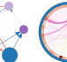

# **C**ell **C**ell **SIG**naling



Command line scripts to perform intracellular signaling analysis.


## Installation

For now, just clone this repository and and run the pipeline scripts. 

```bash
git clone https://github.com/nathanin/ccsig
cd ccsig
pip install -r requirements.txt
```

We use and depend on `anndata` and `scanpy` to read and manipulate single cell expression data.
The standard scientific python libraries including `numpy`, `pandas`, `scipy`, `scikit-learn`, `matplotlib`, `seaborn` and `graphviz` are used.
The parallelized workflows in this project were made possible by [`ray`](https://github.com/ray-project/ray).

Tested on ubuntu 16.04 and 18.04.

<!-- [google](http://www.google.com) -->

---

## Pipelines

A brief description of the individual piplines is provided here.
To run each pipeline, locate the `*_run.py` script and run it. 
For more information see the README within each pipeline directory.

### Receptor scoring Pipeline

Apply a gene set score across single cells by testing the average deviation from a background distribution drawn from similar cells. 

inputs | format
-------|--------
single cell gene expression | AnnData
cell type annotation | column in `obs`
receptor associated gene sets | directory of `*.txt` files with one gene list per file, newline delimited


outputs | format
-------|--------
single cell receptor activity scores | AnnData


### Interaction Test Pipeline

Test the interaction potential on ligand-receptor channels between cell types. 


inputs | format
-------|--------
single cell gene expression | AnnData
single cell receptor activity scores | AnnData
cell type annotation | column in `obs` indicating cell types to test
sample annotation | column in `obs` indicating individual samples
ligand-receptor interactions | a pickled dictionary: `{'receptor': ['ligand1', 'ligand2']}`


outputs | format
-------|--------
interaction potentials | pickled `pd.DataFrame`s with nonzero elements where the interaction passes a permuation test

